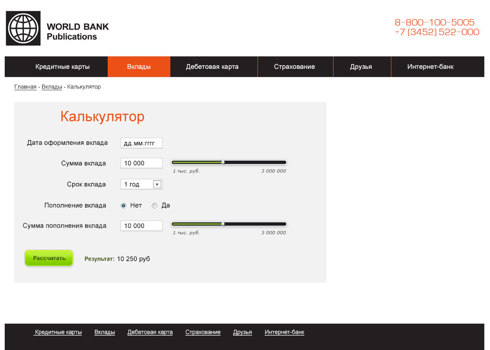

Тестовое задание для web-разработчика
==========================================

В задании будет несколько задач, их необходимо выполнять последовательно, они взаимосвязаны.

Данное задание показывает знания в основных направлениях веб разработки: HTML, CSS, JS (JQuery). Если есть какой-то пробел или не достаточные знания в одной области, и есть интерес это изучить, то отправьте задание с комментарием в том месте, где не получилось решить, с указанием причины и пожеланий.

Результат разместите на GitHub и в письме пришлите ссылку на GitHub pages.

Успешного выполнения задания!

### 1	Сверстать web-страницу, состоящую из шапки и футера, согласно макету bank.psd

1.1 Футер (подвал) должен быть всегда прижат к нижней части окна браузера

1.2 В шапке должно быть меню

1.3 Также добавить «хлебные крошки»

1.4 Выдержать ширину основного контейнера, как в макете

1.5 Желательно сверстать с учётом кроссбраузерности

### 2 Сверстать блок Калькулятора, без бегунков

2.1 Сверстать блок калькулятора с заголовком, полями ввода, выпадающим списком и радиобатоннами (по умолчанию активно «Нет»)

2.2 В правой части есть 2 бегунка, их пока верстать не нужно

2.3 Поля формы:

2.3.1 Дата оформления вклада (поле для ввода даты в формате d.m.Y, подключить календарь п.2.4-----)
 	
2.3.2 Сумма вклада (поле для ввода, минимальное значение – 1000, максимальное – 3000000)

2.3.3 Срок вклада (список 5 лет, с разбивкой по годам)

2.3.4 Пополнение вклада (список, с возможными вариантами: да, нет)

2.3.5 Сумма пополнения вклада (поле для ввода, минимальное значение – 1000, максимальное – 3000000)

### 3	Сверстать бегунки в блоке Калькулятор + Подключить js библиотеку для работы с бегунками

3.1 В блоке Калькулятора есть 2 бегунка, необходимо подключить js библиотеку, которая позволит динамически работать с данными бегунками.

3.2 Задать пороги для бегунков от 1 000 до 3 000 000

3.3 При изменении положения бегунка, значение в соответствующем поле ввода должно меняться

3.4 Использование стилей бегунков как в макете являются не обязательными, но будет значительным плюсом

3.5	Подключить плагин выбора даты для первого поля в калькуляторе:

3.5.1 Для решения данной задачи, необходимо подключить Datepicker http://jqueryui.com/datepicker/

### 4	Создать логику расчета прибыли по вкладам

4.1 Необходимо создать отдельный файл для расчета – calc.php, в котором будет происходить весь расчет калькулятора.

4.2 Данные из HTML формы должны приходить POST запросом и обрабатываться в файле calc.php.

4.3 Результаты расчета вывести на страницу (вывод результата без перезагрузки страницы, с помощью jQuery AJAX)
 	
4.4 Использование валидации (проверку полей ввода) формы на стороне клиента являются не обязательными, но будет значительным плюсом

4.5 Формула с капитализаций процентов по вкладу:

4.5.1 summn = summn-1 + (summn-1 + summadd)*daysn*(percent / daysy)

4.5.2 где summn – сумма на счете на месяц n (руб),

4.5.3 summn-1 – сумма на счете на конец прошлого месяца

4.5.4 summadd – сумма ежемесячного пополнения

4.5.5 daysn – количество дней в данном месяце, на которые приходился вклад

4.5.6 percent – процентная ставка банка - 10%

4.5.7 daysy – количество дней в году.

4.5.8 Если в поле «Пополнение вклада» стоит «нет», данные «summadd» не используются.

### 5 Результат

Любой результат желательно должен содержать следующее:

 index.php – верстка страницы и пользовательская форма
 
 calc.php – php скрипт-обработчик калькулятора
 
 styles.css – стили оформления
 
 script.js – вспомогательные js скрипты
 
 возможны дополнительные библиотеки
 
Если выполнены не все пункты из данного задания, просто опишите причину и отправьте результат нам. Часть выполненных заданий не является критерием принятия на работу! Этот тест нужен для определения всех навыков, с пониманием какие необходимо будет подтянуть.

